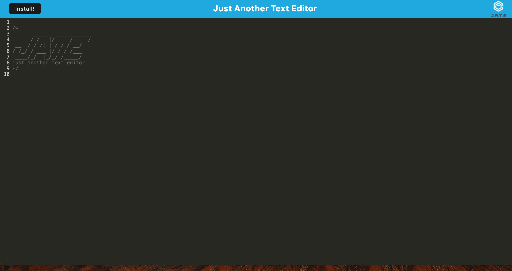

# Just Another Text Editor

## Description 

The purpose of this project was to build a Progressive Web Application using the existing starter code. The completed project is a text editor which can run in the browser online and offline.

## Installation

To install this application, [click here](https://ajp-text-editor.onrender.com/) to visit the deployed site, and then on the install button. If the application is installed correctly, you should receive a confirmation alert. You will then be able to find the J.A.T.E installed on your device. 

## Usage 

To use the appliation online, visit the site. To open the the application offline, first install it, then click on the icon on your device. 

Click on line 10 to move the cursor below the J.A.T.E. header, and then start typing. 

## Credits

I used [this guide](https://developer.chrome.com/docs/workbox/modules/workbox-recipes) to learn more about the workbox recipes that are used in this application. 

## License 

This application was created for educational purposes and does not have a license. 
